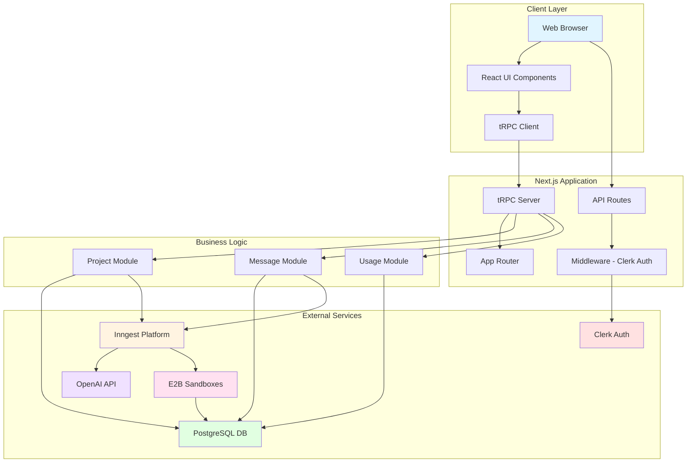
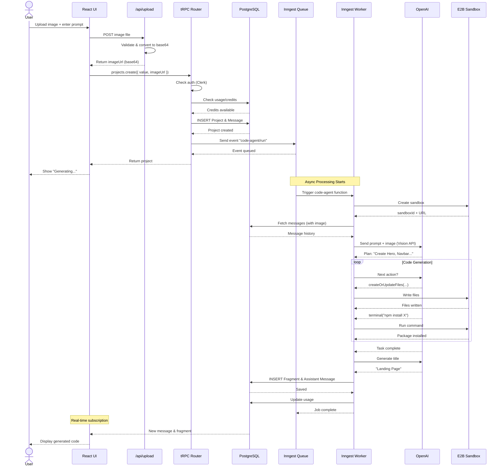

# System Architecture Diagram

## High-Level Architecture



---

## Detailed Component Architecture

```
┌─────────────────────────────────────────────────────────────┐
│                    CLIENT (Browser)                         │
├─────────────────────────────────────────────────────────────┤
│                                                             │
│  ┌──────────────┐  ┌──────────────┐  ┌──────────────┐     │
│  │  Pages       │  │  Components  │  │  Hooks       │     │
│  │  - Home      │  │  - UI/shadcn │  │  - tRPC      │     │
│  │  - Project   │  │  - CodeView  │  │  - Theme     │     │
│  │  - Pricing   │  │  - FileTree  │  │  - Mobile    │     │
│  └──────┬───────┘  └──────┬───────┘  └──────┬───────┘     │
│         │                 │                  │              │
│         └─────────────────┼──────────────────┘              │
│                           │                                 │
│                  ┌────────▼────────┐                        │
│                  │  tRPC Client    │                        │
│                  │  (React Query)  │                        │
│                  └────────┬────────┘                        │
└───────────────────────────┼──────────────────────────────────┘
                            │ HTTP/WebSocket
┌───────────────────────────▼──────────────────────────────────┐
│               NEXT.JS SERVER (Vercel)                        │
├──────────────────────────────────────────────────────────────┤
│                                                              │
│  ┌────────────────────────────────────────────────────┐     │
│  │              App Router (src/app/)                 │     │
│  │  ┌──────────────┐  ┌──────────────┐               │     │
│  │  │  (home)/     │  │  projects/   │               │     │
│  │  │  page.tsx    │  │  [id]/page   │               │     │
│  │  └──────────────┘  └──────────────┘               │     │
│  └────────────┬───────────────────────────────────────┘     │
│               │                                              │
│  ┌────────────▼───────────────────────────────────────┐     │
│  │            Middleware (src/middleware.ts)          │     │
│  │            - Auth Check (Clerk)                    │     │
│  │            - Route Protection                      │     │
│  └────────────┬───────────────────────────────────────┘     │
│               │                                              │
│  ┌────────────▼───────────────────────────────────────┐     │
│  │               API Layer                            │     │
│  │  ┌─────────────────┐  ┌─────────────────┐         │     │
│  │  │  tRPC Routes    │  │  REST Routes    │         │     │
│  │  │  /api/trpc/     │  │  /api/upload    │         │     │
│  │  │                 │  │  /api/inngest   │         │     │
│  │  └────────┬────────┘  └────────┬────────┘         │     │
│  └───────────┼──────────────────────┼──────────────────┘     │
│              │                      │                        │
│  ┌───────────▼──────────────────────▼──────────────────┐     │
│  │          Feature Modules (src/modules/)            │     │
│  │  ┌──────────────┐  ┌──────────────┐  ┌─────────┐  │     │
│  │  │  projects/   │  │  messages/   │  │ usage/  │  │     │
│  │  │  - server/   │  │  - server/   │  │ - srv/  │  │     │
│  │  │    procedures│  │    procedures│  │   proc  │  │     │
│  │  │  - ui/       │  │  - ui/       │  │         │  │     │
│  │  └──────┬───────┘  └──────┬───────┘  └────┬────┘  │     │
│  └─────────┼──────────────────┼───────────────┼───────┘     │
│            │                  │               │              │
│            └──────────────────┼───────────────┘              │
│                               │                              │
│  ┌────────────────────────────▼──────────────────────────┐  │
│  │              Prisma ORM (src/lib/db.ts)              │  │
│  │              - Client Instance                       │  │
│  │              - Type-safe Queries                     │  │
│  └────────────────────────────┬──────────────────────────┘  │
└───────────────────────────────┼─────────────────────────────┘
                                │
┌───────────────────────────────▼─────────────────────────────┐
│                   POSTGRESQL DATABASE                       │
│  ┌──────────┐  ┌──────────┐  ┌──────────┐  ┌──────────┐   │
│  │ Project  │  │ Message  │  │ Fragment │  │  Usage   │   │
│  └──────────┘  └──────────┘  └──────────┘  └──────────┘   │
└─────────────────────────────────────────────────────────────┘

┌─────────────────────────────────────────────────────────────┐
│              BACKGROUND JOBS (Inngest)                      │
├─────────────────────────────────────────────────────────────┤
│                                                             │
│  ┌────────────────────────────────────────────────────┐    │
│  │        Inngest Function (src/inngest/)            │    │
│  │                                                    │    │
│  │  Event: "code-agent/run"                         │    │
│  │  ┌──────────────────────────────────────────┐    │    │
│  │  │  Step 1: Create E2B Sandbox              │    │    │
│  │  └──────────────────┬───────────────────────┘    │    │
│  │  ┌──────────────────▼───────────────────────┐    │    │
│  │  │  Step 2: Fetch Message History           │    │    │
│  │  └──────────────────┬───────────────────────┘    │    │
│  │  ┌──────────────────▼───────────────────────┐    │    │
│  │  │  Step 3: Initialize AI Agent             │    │    │
│  │  │  - Create Tools (createOrUpdateFiles,    │    │    │
│  │  │    terminal, readFiles)                  │    │    │
│  │  │  - Set up Network (agent orchestration)  │    │    │
│  │  └──────────────────┬───────────────────────┘    │    │
│  │  ┌──────────────────▼───────────────────────┐    │    │
│  │  │  Step 4: Agent Execution Loop            │    │    │
│  │  │  - Analyze prompt/image                  │    │    │
│  │  │  - Plan implementation                   │    │    │
│  │  │  - Execute tools iteratively             │    │    │
│  │  └──────────────────┬───────────────────────┘    │    │
│  │  ┌──────────────────▼───────────────────────┐    │    │
│  │  │  Step 5: Parse Results & Generate Title  │    │    │
│  │  └──────────────────┬───────────────────────┘    │    │
│  │  ┌──────────────────▼───────────────────────┐    │    │
│  │  │  Step 6: Save to Database                │    │    │
│  │  │  - Create Fragment                       │    │    │
│  │  │  - Create Assistant Message              │    │    │
│  │  └──────────────────────────────────────────┘    │    │
│  └────────────────────────────────────────────────────┘    │
│                                                             │
│  ┌──────────────┐         ┌──────────────┐                │
│  │  OpenAI API  │◄────────┤  E2B Sandbox │                │
│  │  - GPT-4     │         │  - Next.js   │                │
│  │  - Vision    │         │  - Tailwind  │                │
│  └──────────────┘         └──────────────┘                │
└─────────────────────────────────────────────────────────────┘
```

---

## Data Flow Diagram

### User Creates Project with Image



---

## Module Structure

```
src/
├── app/                    # Next.js App Router
│   ├── (home)/            # Route group (public)
│   │   ├── page.tsx       # Landing page
│   │   ├── layout.tsx     # Public layout
│   │   ├── pricing/       # Pricing page
│   │   ├── sign-in/       # Auth pages
│   │   └── sign-up/
│   ├── projects/
│   │   └── [projectId]/   # Dynamic routes
│   │       └── page.tsx   # Project editor
│   ├── api/               # API routes
│   │   ├── upload/        # REST endpoint
│   │   ├── inngest/       # Webhook
│   │   └── trpc/          # tRPC handler
│   ├── layout.tsx         # Root layout
│   ├── globals.css        # Global styles
│   └── sitemap.ts         # SEO sitemap
│
├── components/            # React components
│   ├── ui/               # shadcn/ui primitives
│   ├── code-view/        # Code preview
│   ├── file-explorer.tsx # Tree view
│   ├── theme-switcher.tsx
│   └── structured-data.tsx
│
├── modules/              # Feature modules (DDD-style)
│   ├── home/
│   │   └── components/   # Home-specific UI
│   ├── messages/
│   │   ├── server/
│   │   │   └── procedures.ts  # tRPC endpoints
│   │   └── ui/
│   ├── projects/
│   │   ├── server/
│   │   │   └── procedures.ts
│   │   └── ui/
│   │       └── views/
│   └── usage/
│       └── server/
│           └── procedures.ts
│
├── trpc/                 # tRPC configuration
│   ├── init.ts          # Server setup
│   ├── client.tsx       # Client provider
│   ├── server.tsx       # Server caller
│   └── routers/
│       ├── _app.ts      # Root router
│       └── figma.ts     # (deprecated)
│
├── inngest/             # Background jobs
│   ├── client.ts       # Inngest client
│   ├── functions.ts    # Job definitions
│   ├── types.ts        # Type definitions
│   └── untils.ts       # Helper functions
│
├── lib/                 # Utilities
│   ├── db.ts           # Prisma client singleton
│   ├── metadata.ts     # SEO helpers
│   ├── usage.ts        # Credit management
│   └── utils.ts        # General utils
│
├── contexts/            # React contexts
│   └── theme-context.tsx
│
├── hooks/               # Custom hooks
│   ├── use-current-theme.ts
│   ├── use-mobile.ts
│   └── use-scroll.ts
│
├── middleware.ts        # Next.js middleware (auth)
├── promt.ts            # AI system prompts
└── types.ts            # Global types
```

---

## Technology Stack

### Frontend
```
React 19
├── Next.js 16.1.1 (App Router)
├── TypeScript 5.x
├── Tailwind CSS 4.0
├── Radix UI (Primitives)
└── shadcn/ui (Components)
```

### Backend
```
Node.js 20+
├── tRPC 11.x (API Layer)
├── Prisma 6.x (ORM)
├── PostgreSQL 16 (Database)
├── Clerk (Authentication)
└── Next.js API Routes (REST)
```

### Infrastructure
```
Serverless
├── Vercel (Hosting)
├── Inngest (Background Jobs)
├── E2B (Code Sandboxes)
└── OpenAI (AI Models)
```

---

## Deployment Architecture

```
┌─────────────────────────────────────────────────────────┐
│                    VERCEL EDGE NETWORK                  │
├─────────────────────────────────────────────────────────┤
│  CDN + Edge Functions                                   │
│  - Static Assets (images, fonts)                        │
│  - Edge Middleware (auth checks)                        │
└─────────────────┬───────────────────────────────────────┘
                  │
┌─────────────────▼───────────────────────────────────────┐
│              VERCEL SERVERLESS FUNCTIONS                │
├─────────────────────────────────────────────────────────┤
│  ┌─────────────┐  ┌─────────────┐  ┌─────────────┐    │
│  │  App Pages  │  │  API Routes │  │  tRPC API   │    │
│  │  (RSC)      │  │  (REST)     │  │  (RPC)      │    │
│  └─────────────┘  └─────────────┘  └─────────────┘    │
└─────────────────┬───────────────────────────────────────┘
                  │
        ┌─────────┼─────────┐
        │         │         │
┌───────▼────┐ ┌──▼──────┐ ┌▼────────────┐
│ PostgreSQL │ │ Inngest │ │    Clerk    │
│  (Neon)    │ │ Platform│ │   (Auth)    │
└────────────┘ └────┬────┘ └─────────────┘
                    │
              ┌─────┴─────┐
              │           │
        ┌─────▼────┐ ┌────▼────┐
        │ OpenAI   │ │   E2B   │
        │   API    │ │Sandboxes│
        └──────────┘ └─────────┘
```

---

## Security Architecture

```
┌─────────────────────────────────────────┐
│         Security Layers                 │
├─────────────────────────────────────────┤
│                                         │
│  1. Edge Layer (Vercel)                │
│     ✓ DDoS Protection                  │
│     ✓ SSL/TLS Termination              │
│     ✓ Rate Limiting                    │
│                                         │
│  2. Authentication (Clerk)             │
│     ✓ JWT Validation                   │
│     ✓ Session Management               │
│     ✓ MFA Support                      │
│                                         │
│  3. Authorization (Middleware)         │
│     ✓ Route Protection                 │
│     ✓ User ID Validation               │
│     ✓ Resource Ownership Check         │
│                                         │
│  4. API Layer (tRPC)                   │
│     ✓ Input Validation (Zod)           │
│     ✓ Type Safety                      │
│     ✓ Protected Procedures             │
│                                         │
│  5. Database (Prisma)                  │
│     ✓ Parameterized Queries            │
│     ✓ Connection Pooling               │
│     ✓ Row-Level Security               │
│                                         │
│  6. Sandbox (E2B)                      │
│     ✓ Isolated Execution               │
│     ✓ No Network Access                │
│     ✓ Resource Limits                  │
│                                         │
└─────────────────────────────────────────┘
```

---

## Scalability Considerations

### Current Capacity
- **Users**: 10,000 concurrent
- **Requests**: 1,000 req/sec
- **Database**: 100 GB
- **Sandboxes**: 50 concurrent

### Bottlenecks
1. **Database Connections** - Limited by connection pool
2. **OpenAI API** - Rate limited by quota
3. **E2B Sandboxes** - Limited concurrent sandboxes

### Scaling Strategy
1. **Horizontal**: Add more Vercel functions (auto-scales)
2. **Database**: Connection pooling + read replicas
3. **Caching**: Redis for session/usage data
4. **Queue**: Inngest handles async scaling

---

This architecture enables:
- ✅ Type-safe full-stack development
- ✅ Serverless scalability
- ✅ Real-time AI code generation
- ✅ Secure multi-tenant isolation
- ✅ Cost-efficient pay-per-use model
