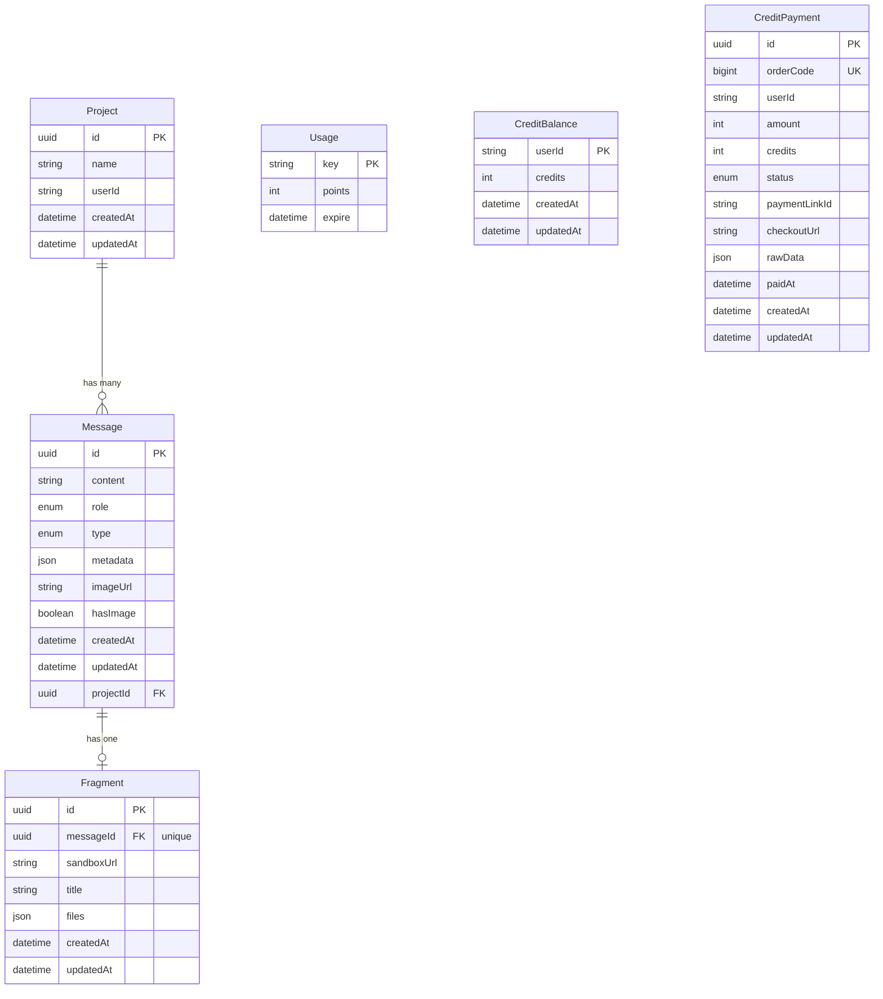

# Database Schema & ERD

## Entity Relationship Diagram



## Tables Description

### 1. **Project**
Stores user projects/workspaces where code generation happens.

| Column | Type | Constraints | Description |
|--------|------|-------------|-------------|
| `id` | UUID | PRIMARY KEY, DEFAULT uuid_generate_v4() | Unique identifier |
| `name` | String | NOT NULL | Project name (auto-generated slug) |
| `userId` | String | NOT NULL | Clerk user ID (external auth) |
| `createdAt` | DateTime | DEFAULT now() | Creation timestamp |
| `updatedAt` | DateTime | AUTO UPDATE | Last modification timestamp |

**Relationships:**
- One-to-Many with `Message` (cascade delete)

**Indexes:**
- Primary: `id`
- Composite: `(userId, updatedAt DESC)` for user project listing

---

### 2. **Message**
Chat messages between user and AI, including prompts and responses.

| Column | Type | Constraints | Description |
|--------|------|-------------|-------------|
| `id` | UUID | PRIMARY KEY | Unique identifier |
| `content` | String | NOT NULL | Message text content |
| `role` | Enum | NOT NULL | `USER` or `ASSISTANT` |
| `type` | Enum | NOT NULL | `RESULT` or `ERROR` |
| `metadata` | JSON | NULLABLE | Additional data (tokens, model, etc.) |
| `imageUrl` | String | NULLABLE | Base64 or URL of uploaded image |
| `hasImage` | Boolean | DEFAULT false | Quick check for image presence |
| `createdAt` | DateTime | DEFAULT now() | Message timestamp |
| `updatedAt` | DateTime | AUTO UPDATE | Last update |
| `projectId` | UUID | FOREIGN KEY, NOT NULL | Reference to Project |

**Enums:**
```typescript
enum MessageRole {
  USER       // User's prompt or question
  ASSISTANT  // AI's response
}

enum MessageType {
  RESULT     // Successful generation
  ERROR      // Error message
}
```

**Relationships:**
- Many-to-One with `Project` (cascade delete)
- One-to-One with `Fragment` (cascade delete)

**Indexes:**
- Primary: `id`
- Foreign Key: `projectId`
- Composite: `(projectId, createdAt ASC)` for chat history

---

### 3. **Fragment**
Generated code artifacts from AI, linked to assistant messages.

| Column | Type | Constraints | Description |
|--------|------|-------------|-------------|
| `id` | UUID | PRIMARY KEY | Unique identifier |
| `messageId` | UUID | FOREIGN KEY, UNIQUE, NOT NULL | Reference to Message |
| `sandboxUrl` | String | NOT NULL | E2B sandbox preview URL |
| `title` | String | NOT NULL | Short description (e.g., "Landing Page") |
| `files` | JSON | NOT NULL | Generated files `{ [path]: content }` |
| `createdAt` | DateTime | DEFAULT now() | Creation timestamp |
| `updatedAt` | DateTime | AUTO UPDATE | Last update |

**JSON Structure for `files`:**
```json
{
  "app/page.tsx": "export default function Page() {...}",
  "components/Hero.tsx": "export function Hero() {...}",
  "lib/utils.ts": "export const cn = (...)"
}
```

**Relationships:**
- One-to-One with `Message` (cascade delete)

**Indexes:**
- Primary: `id`
- Unique: `messageId`

---

### 4. **Usage**
Tracks free quota usage per user. Free credits reset every 30 days.

| Column | Type | Constraints | Description |
|--------|------|-------------|-------------|
| `key` | String | PRIMARY KEY | User identifier (usually Clerk userId) |
| `points` | Integer | NOT NULL | Free credits consumed in current cycle |
| `expire` | DateTime | NULLABLE | Free quota reset time |

**Indexes:**
- Primary: `key`

---

### 5. **CreditBalance**
Stores paid credits purchased through PayOS. Paid credits stack across purchases and do not reset.

| Column | Type | Constraints | Description |
|--------|------|-------------|-------------|
| `userId` | String | PRIMARY KEY | Clerk user ID |
| `credits` | Integer | DEFAULT 0 | Paid credits remaining |
| `createdAt` | DateTime | DEFAULT now() | Creation timestamp |
| `updatedAt` | DateTime | AUTO UPDATE | Last update |

**Indexes:**
- Primary: `userId`

---

### 6. **CreditPayment**
Stores PayOS checkout/payment logs for user billing and admin reconciliation.

| Column | Type | Constraints | Description |
|--------|------|-------------|-------------|
| `id` | UUID | PRIMARY KEY | Unique payment record |
| `orderCode` | BigInt | UNIQUE, NOT NULL | PayOS order code |
| `userId` | String | NOT NULL | Clerk user ID |
| `amount` | Integer | NOT NULL | Payment amount in VND |
| `credits` | Integer | NOT NULL | Credits to add when paid |
| `description` | String | NOT NULL | PayOS payment description |
| `status` | Enum | DEFAULT PENDING | PENDING/PAID/CANCELLED/EXPIRED/FAILED |
| `paymentLinkId` | String | NULLABLE | PayOS payment link ID |
| `checkoutUrl` | String | NULLABLE | PayOS checkout URL |
| `payosStatus` | String | NULLABLE | PayOS status/description |
| `rawData` | JSON | NULLABLE | Raw PayOS payload |
| `paidAt` | DateTime | NULLABLE | Payment confirmation time |
| `createdAt` | DateTime | DEFAULT now() | Creation timestamp |
| `updatedAt` | DateTime | AUTO UPDATE | Last update |

**Indexes:**
- Primary: `id`
- Unique: `orderCode`
- Secondary: `userId`, `status`

---

## Database Constraints

### Foreign Keys
```sql
-- Message -> Project
ALTER TABLE "Message" 
  ADD CONSTRAINT "Message_projectId_fkey" 
  FOREIGN KEY ("projectId") 
  REFERENCES "Project"("id") 
  ON DELETE CASCADE;

-- Fragment -> Message
ALTER TABLE "Fragment" 
  ADD CONSTRAINT "Fragment_messageId_fkey" 
  FOREIGN KEY ("messageId") 
  REFERENCES "Message"("id") 
  ON DELETE CASCADE;
```

### Unique Constraints
- `Fragment.messageId` - One fragment per message

### Check Constraints
- `Message.content` length <= 5000 characters (application-level)
- `Usage.points` >= 0 (application-level)

---

## Sample Data Flow

### 1. User Creates Project
```sql
INSERT INTO "Project" (id, name, userId)
VALUES ('uuid-1', 'my-landing-page', 'user_123');
```

### 2. User Sends Message with Image
```sql
INSERT INTO "Message" (id, content, role, type, imageUrl, hasImage, projectId)
VALUES (
  'uuid-2',
  'Create a hero section from this design',
  'USER',
  'RESULT',
  'data:image/png;base64,...',
  true,
  'uuid-1'
);
```

### 3. AI Generates Code
```sql
-- AI Response Message
INSERT INTO "Message" (id, content, role, type, projectId, metadata)
VALUES (
  'uuid-3',
  'I created a hero section with responsive design...',
  'ASSISTANT',
  'RESULT',
  'uuid-1',
  '{"model": "gpt-4", "tokens": 1500}'
);

-- Code Fragment
INSERT INTO "Fragment" (id, messageId, sandboxUrl, title, files)
VALUES (
  'uuid-4',
  'uuid-3',
  'https://sandbox.e2b.dev/abc123',
  'Hero Section',
  '{"app/page.tsx": "...", "components/Hero.tsx": "..."}'
);
```

### 4. Consume Credit
```sql
-- Paid credits are consumed first.
UPDATE "CreditBalance"
SET credits = credits - 1, "updatedAt" = NOW()
WHERE "userId" = 'user_123' AND credits >= 1;

-- If no paid credit was available, consume one free quota point.
INSERT INTO "Usage" (key, points, expire)
VALUES ('user_123', 1, NOW() + INTERVAL '30 days')
ON CONFLICT (key)
DO UPDATE SET points = "Usage".points + 1;
```

### 5. Apply PayOS Payment
```sql
INSERT INTO "CreditBalance" ("userId", credits, "updatedAt")
VALUES ('user_123', 100, NOW())
ON CONFLICT ("userId")
DO UPDATE SET
  credits = "CreditBalance".credits + 100,
  "updatedAt" = NOW();
```

---

## Queries Used in Application

### Get Project with Messages
```sql
SELECT p.*, 
       json_agg(
         json_build_object(
           'id', m.id,
           'content', m.content,
           'role', m.role,
           'hasImage', m."hasImage",
           'fragment', f.*
         ) ORDER BY m."createdAt" ASC
       ) as messages
FROM "Project" p
LEFT JOIN "Message" m ON p.id = m."projectId"
LEFT JOIN "Fragment" f ON m.id = f."messageId"
WHERE p.id = $1 AND p."userId" = $2
GROUP BY p.id;
```

### Get User's Recent Projects
```sql
SELECT id, name, "updatedAt"
FROM "Project"
WHERE "userId" = $1
ORDER BY "updatedAt" DESC
LIMIT 10;
```

### Check User Credits
```sql
SELECT
  COALESCE(cb.credits, 0) AS paid_credits,
  GREATEST(30 - COALESCE(u.points, 0), 0) AS free_credits,
  u.expire AS free_reset_at
FROM (SELECT $1::text AS user_id) input
LEFT JOIN "CreditBalance" cb ON cb."userId" = input.user_id
LEFT JOIN "Usage" u ON u.key = input.user_id
  AND (u.expire IS NULL OR u.expire > NOW());
```

---

## Migration History

| Version | Date | Description |
|---------|------|-------------|
| `20260101045048_init` | 2026-01-01 | Initial schema with Project, Message |
| `20260104030603_message_fragment` | 2026-01-04 | Added Fragment table |
| `20260104035633_projects` | 2026-01-04 | Updated Project fields |
| `20260105155558_user_id` | 2026-01-05 | Added userId to Project |
| `20260105165704_usage` | 2026-01-05 | Added Usage table |
| `20260108040649_add_message_metadata` | 2026-01-08 | Added metadata to Message |
| `20260117143638_add_image_support` | 2026-01-17 | Added imageUrl, hasImage to Message |
| `20260518120000_add_credit_payments` | 2026-05-18 | Added CreditPayment table and PayOS status enum |
| `20260518133000_add_credit_balance` | 2026-05-18 | Added CreditBalance and migrated paid credits |

---

## Database Best Practices

### Indexing Strategy
- **Primary Keys**: All UUIDs indexed by default
- **Foreign Keys**: Auto-indexed for JOIN performance
- **Composite Indexes**: Used for common query patterns
- **JSON Fields**: Not indexed (use PostgreSQL JSONB if needed)

### Data Retention
- Projects: Retained indefinitely (user-owned)
- Messages: Cascade deleted with Project
- Fragments: Cascade deleted with Message
- Usage: Free quota can expire/reset by cycle
- CreditBalance: Retained while user account exists
- CreditPayment: Retained for billing history and reconciliation

### Backup Strategy
- Daily automated backups
- Point-in-time recovery enabled
- Backup retention: 30 days

---

## Prisma Schema

Full schema available at: `prisma/schema.prisma`

```prisma
generator client {
  provider      = "prisma-client-js"
  output        = "../src/generated/prisma"
  binaryTargets = ["native", "rhel-openssl-3.0.x"]
}

datasource db {
  provider = "postgresql"
  url      = env("DATABASE_URL")
}

// ... (see schema.prisma for complete definition)
```

---

## Scaling Considerations

### Current Limitations
- Max message content: 5000 characters
- Image size: 5MB (application-level)
- No sharding implemented

### Future Improvements
- [ ] Partition Message table by date
- [ ] Add full-text search on content
- [ ] Implement read replicas
- [ ] Archive old projects to cold storage
- [ ] Add indexes on metadata JSONB fields
